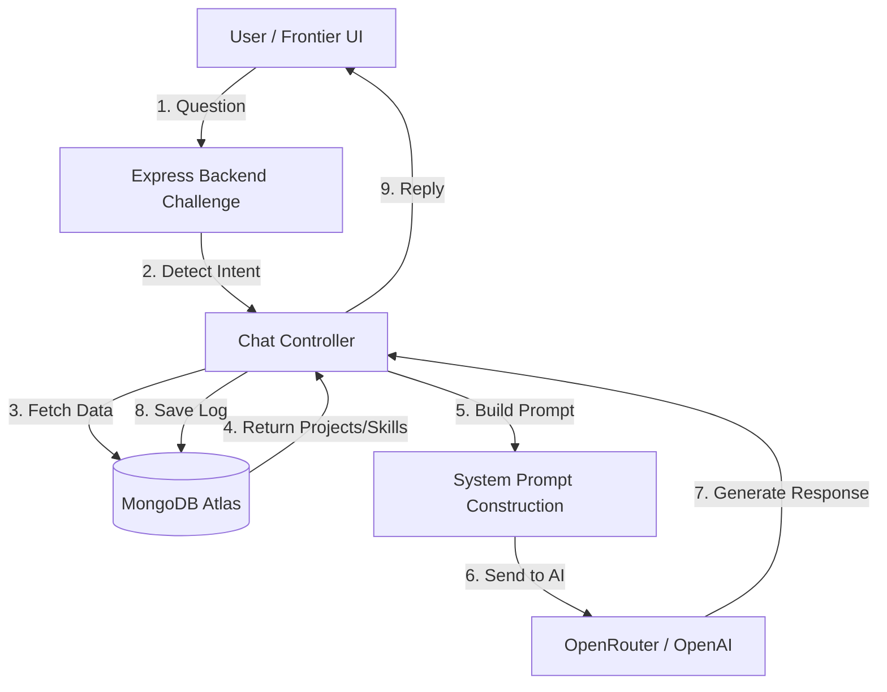

# Chatbot System Design

## 1. High-Level Architecture
This chatbot is designed as a **RAG-lite (Retrieval-Augmented Generation)** system. It does not blindly answer questions; it fetches specific data from your portfolio database to ground its responses.

## 2. Key Components

### A. Intent Detection Engine
Instead of sending every request to the AI immediately, we first classify what the user wants. This saves tokens and increases accuracy.
-   **Logic**: Simple keyword analysis (e.g., "projects" -> `Intent: Projects`).
-   **Benefit**: If the user asks for "Contact Info", we fetch *exact* contact details from the DB instead of letting the AI guess.

### B. Dynamic Context Injection
We strictly control what the AI knows.
-   **Input**: "What libraries do you know?"
-   **DB Fetch**: Query `Skill.find({ category: 'Library' })`.
-   **System Prompt**: "You are Nomaan. Here is a list of your libraries: ['React', 'Redux']. Answer the user."
-   **Result**: The AI *cannot* hallucinate skills you don't have.

### C. Chat Memory (Session Management)
We use MongoDB to store conversation history (`ChatLog`).
-   On every request, we fetch the last **10 messages** for that `sessionId`.
-   This allows follow-up questions like "Tell me more about the first one."

## 3. Database Schema

### `ChatLog`
| Field | Type | Purpose |
| :--- | :--- | :--- |
| `sessionId` | String | Identify the user session |
| `role` | Enum | User or Assistant |
| `content` | String | The text message |
| `metadata` | JSON | Store detected intent and latency |

### `ChatbotSettings` (Singleton)
| Field | Type | Purpose |
| :--- | :--- | :--- |
| `enabled` | Boolean | Kill switch for the bot |
| `responseStyle` | String | Concise vs Detailed |
| `systemPrompt` | String | Override default behavior |

## 4. Security & Performance
-   **Rate Limiting**: The API is protected by `express-rate-limit` (60 requests/hour IP).
-   **Sanitization**: All inputs are sanitized to prevent NoSQL injection.
-   **Fail-Safe**: If OpenRouter is down, the system returns a polite fallback message.

## 5. Why this Design? (Viva Answer)
"I chose a **RAG-based approach** over fine-tuning a model because my portfolio data changes frequently. If I add a new project to the CMS, the chatbot immediately knows about it without retraining. It is more cost-effective and accurate for a dynamic CV."
